# OpenClaw Workflow Architecture

> Declarative, contract-driven workflow orchestration for OpenClaw agents.

`openclaw-workflow` turns multi-step agent work into a durable, reviewable workflow runtime. Instead of wiring agents together with shell scripts, manual timing, or ad hoc prompts, the workflow file becomes the contract: it declares dependencies, outputs, validators, retry policy, cache behavior, state resources, and resumable queue-backed processing.

The core architectural principle is:

> Keep workflow intent declarative, keep execution state durable, and keep large/raw tool results out of model context unless explicitly read through bounded artifact access.

---

## System Overview Diagram

```mermaid
flowchart TD
    A[Workflow YAML / JSON] --> B[Authoring Loader]
    B --> C[Authoring Compiler]
    C --> D[Execution Workflow Definition]
    D --> E[Template + Schema Validator]
    E --> F[Workflow Executor]

    F --> G[Dependency Scheduler]
    F --> H[State Backend]
    F --> I[Artifact Store]

    G --> J[Step Runner]
    J --> K[Session Adapter]
    K --> L[OpenClaw Runtime Subagent]
    K --> M[Legacy Session API]
    K --> N[CLI Fallback]

    J --> O[Sealed Step Runner]
    O --> P[Tool Result Middleware]
    P --> Q[Artifact Spool]
    P --> R[Compact Envelope to Model]

    F --> S[Plugin Operations]
    S --> T[State Publish / Claim / Complete]
    T --> H

    F --> U[Output Validators]
    U --> V{Contract Passed?}
    V -- yes --> W[Persist Step Result]
    V -- retry --> X[Retry Step]
    V -- block/fail --> Y[Block or Fail Run]

    W --> Z[Schedule Next Ready Steps]
````

---

## Detailed Component Architecture

### 1. Workflow Definition Layer

```mermaid
flowchart LR
    A[Authoring YAML] --> B[Human-Friendly Schema]
    B --> C[Authoring Loader]
    C --> D[Normalized Authoring Spec]
    D --> E[Authoring Compiler]
    E --> F[Execution Workflow]
```

The workflow definition layer is the public authoring surface. It is intentionally YAML/JSON-driven so workflows can be reviewed, copied, versioned, diffed, and reused without turning orchestration into application code.

**Key responsibilities:**

* load workflow files from `workflowsDir`
* support compact authoring syntax
* normalize defaults, profiles, outputs, and state declarations
* compile public authoring syntax into the internal execution schema
* reject ambiguous or unsafe declarations before execution

**Why this matters:**

Programmatic agent graphs are powerful when the graph logic is the application. `openclaw-workflow` is designed for a different use case: workflows as operational contracts. The YAML file should say what should happen, what each step must produce, and what counts as success. The runtime decides how to schedule, validate, resume, and persist the run.

---

### 2. Authoring Compiler Layer

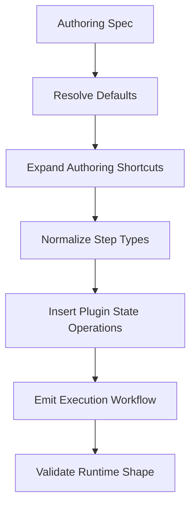

The compiler separates the human-facing workflow format from the runtime format. Authors can write concise workflow definitions, while the executor receives a normalized graph with explicit step kinds, dependencies, outputs, state operations, and runtime metadata.

**Compiler responsibilities:**

| Responsibility            | Purpose                                                                                          |
| ------------------------- | ------------------------------------------------------------------------------------------------ |
| Authoring normalization   | Converts compact YAML into consistent internal structure                                         |
| Step kind inference       | Maps `model`, `browser`, `command`, `plugin`, `drain`, and `for_each` into executable step forms |
| State operation expansion | Turns semantic state declarations into explicit publish/claim/complete/query/report operations   |
| Output normalization      | Converts simple output strings and rich output objects into a uniform contract model             |
| Conflict detection        | Fails fast when top-level state declarations and `with.state_*` values disagree                  |
| Runtime validation        | Ensures the executor receives a predictable execution schema                                     |

**Design justification:**

The authoring schema optimizes for humans. The execution schema optimizes for the runtime. Keeping those separate avoids leaking internal orchestration mechanics into user workflows while still giving the executor a strict and predictable structure.

---

### 3. Runtime Execution Layer

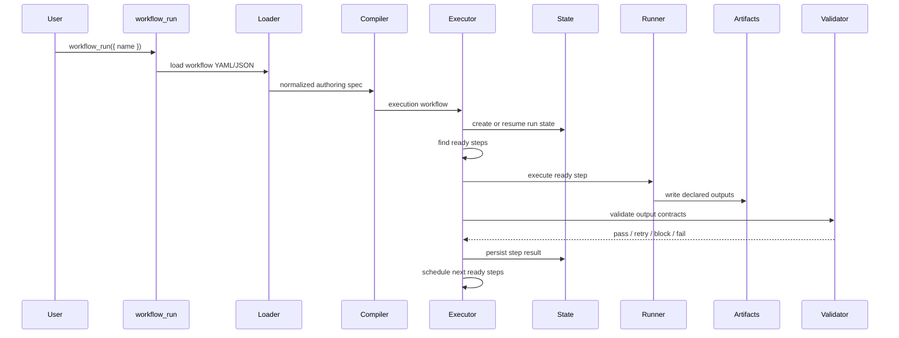

The executor is the workflow control plane. It does not rely on the model to remember which step should run next. It owns dependency resolution, concurrency, retries, timeouts, optional steps, cache adoption, and run-level state transitions.

**Executor responsibilities:**

* create or resume a workflow run
* track per-step lifecycle state
* enforce dependency ordering
* run independent steps concurrently within configured limits
* apply retry and timeout policy
* validate declared outputs before marking a step successful
* persist step results and run metadata
* schedule newly-ready dependent steps
* support cancellation and partial resume

**Core invariant:**

> A step is not successful because an agent said it is done. A step is successful only when the runtime can validate the declared output contract.

---

### 4. Step Runner Layer

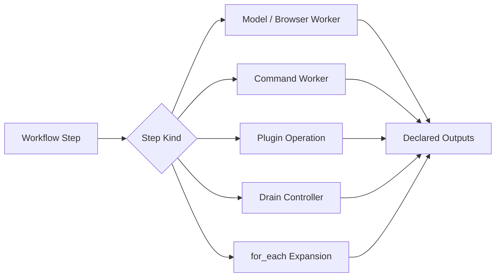

The step runner converts a normalized workflow step into an actual unit of work. Some steps spawn OpenClaw sessions. Some steps run commands. Some steps execute plugin operations directly in the orchestrator. Drain steps coordinate queue-backed batch processing.

**Step types:**

| Step Type           | Used For                                              | Runtime Behavior                                               |
| ------------------- | ----------------------------------------------------- | -------------------------------------------------------------- |
| `model` / `browser` | Agent reasoning, extraction, browsing, classification | Spawn a worker session through the selected adapter            |
| `command`           | Deterministic scripts and transforms                  | Execute a bounded command with stdout/stderr spooling          |
| `plugin`            | Built-in workflow/state operations                    | Run directly in the orchestrator without a subagent            |
| `drain`             | Queue-backed batch processing                         | Claim batches from state, run workers, complete/merge results  |
| `for_each`          | Fan-out over list items                               | Expand one logical step into per-item work                     |
| `sealed`            | Context-safe worker boundary                          | Preserve raw results in artifacts and expose compact envelopes |

**Design justification:**

Different work needs different execution semantics. Agent work benefits from OpenClaw sessions. State transitions should not require an agent. Deterministic transforms should run as commands. Queue draining needs lease/claim semantics. A single step abstraction gives authors one workflow language while letting the runtime choose the safest execution path.

---

### 5. Session Adapter Layer

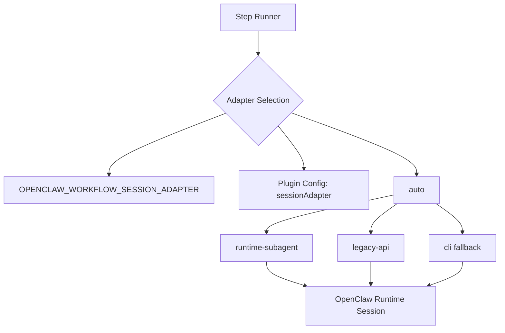

The session adapter layer decouples workflow orchestration from the exact OpenClaw execution API available in the host runtime.

**Adapter precedence:**

1. `OPENCLAW_WORKFLOW_SESSION_ADAPTER` environment variable
2. `sessionAdapter` plugin configuration
3. `auto`, which tries the best available adapter

**Available adapters:**

| Adapter            | Role                                                                  |
| ------------------ | --------------------------------------------------------------------- |
| `runtime-subagent` | Preferred adapter for modern OpenClaw runtime subagent execution      |
| `legacy-api`       | Compatibility path for older session APIs                             |
| `cli`              | Fallback path using the OpenClaw CLI when native APIs are unavailable |
| `auto`             | Capability-aware adapter selection                                    |

**Design justification:**

OpenClaw runtime APIs can evolve. The workflow engine should not force every workflow to change when the host API changes. Adapter selection isolates that instability behind a small boundary. When sealed execution requires tool-result interception, transcript firewalling, and artifact sinking, the adapter layer must fail fast if those capabilities are unavailable.

---

### 6. Sealed Execution Layer

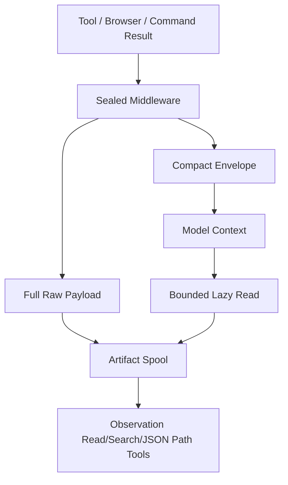

Sealed execution creates a data-plane/control-plane split for agent tool results.

The raw payload is preserved, but the model receives only a bounded envelope unless it explicitly reads more through controlled observation tools. This protects model context from being flooded by large DOMs, browser traces, command logs, API responses, and other bulky tool outputs.

**Sealed execution responsibilities:**

* intercept tool results before they enter model context
* spool full raw payloads to the artifact store
* return compact references and previews to the model
* support bounded lazy reads from stored observations
* preserve auditability without context flooding
* enforce declared outputs as the true completion condition

**Why this matters:**

Agent workflows often fail because the model context becomes polluted with raw tool output. Sealed execution keeps the model focused on decisions while preserving the full evidence trail outside the context window.

**Important runtime requirement:**

Sealed `tool_worker` steps require `agentToolResultMiddleware` registration. In environments where OpenClaw restricts that capability to bundled plugins, the workflow plugin needs the trust patch described in the README. With `requireSealedToolResultMiddleware: true`, startup fails if middleware registration is unavailable, making the issue visible before a workflow silently degrades.

---

### 7. Artifact Store Layer

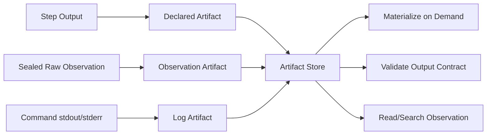

The artifact store preserves workflow outputs, sealed observations, command logs, claim manifests, state reports, and validation evidence.

**Artifact responsibilities:**

* store declared step outputs
* store sealed tool-result payloads
* store command stdout/stderr when output is too large for inline handling
* support `materializeOutputs` modes: `never`, `on_demand`, `always`
* provide stable references for downstream validation and reads
* keep full evidence available without forcing everything into model context

**Design justification:**

Artifacts are the workflow data plane. They let the runtime validate actual outputs, resume later, inspect prior runs, and avoid relying on model memory or transient session transcripts.

---

### 8. State Backend Layer

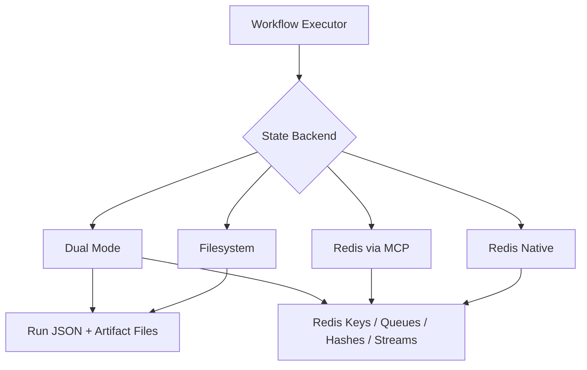

The state backend tracks durable run state, step status, artifacts, semantic collections, queues, leases, counters, and reports.

**Backend modes:**

| Mode           | Purpose                                                         |
| -------------- | --------------------------------------------------------------- |
| `filesystem`   | Simple local development and durable file-backed run state      |
| `redis-native` | Direct Redis access through `ioredis`                           |
| `redis-mcp`    | Redis access through MCP tools exposed by MCPorter              |
| `redis`        | Redis-backed state with transport selection                     |
| `auto`         | Resolve the best available backend from config/environment      |
| `dual`         | Mirror or combine filesystem and Redis behavior where supported |

**Design justification:**

Filesystem state is excellent for local development, inspection, and low-dependency operation. Redis is better for queue-backed state, lease-based claims, counters, streams, and concurrent drain workers. Supporting both lets the runtime stay easy to run locally while enabling scalable queue-backed workflows when Redis is configured.

---

### 9. State Resources and Drain Workers

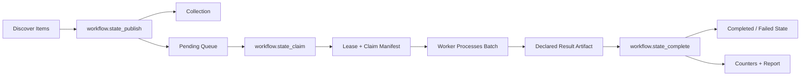

Drain workers make item processing resumable and scalable. Instead of asking one large agent session to process every item, the workflow can publish items into a semantic collection and queue, claim bounded batches, process them, and mark each item complete or failed.

**Core concepts:**

| Concept        | Meaning                                                    |
| -------------- | ---------------------------------------------------------- |
| Collection     | Logical set of documents or work items                     |
| Queue          | Pending work derived from a collection                     |
| Worker Group   | Claim settings for a class of workers                      |
| Lease          | Temporary ownership of claimed items                       |
| Claim Manifest | Artifact describing the bounded batch assigned to a worker |
| Counter        | Run metric such as published, completed, failed            |
| Report         | Bounded summary artifact for state inspection              |

**Design justification:**

Large workflows need resumability. If a worker crashes halfway through a batch, leased work can be reclaimed. If the run is interrupted, state can be inspected and processing can continue. This is safer than passing a huge list to a single agent and hoping it finishes perfectly.

---

### 10. Output Contracts and Validators

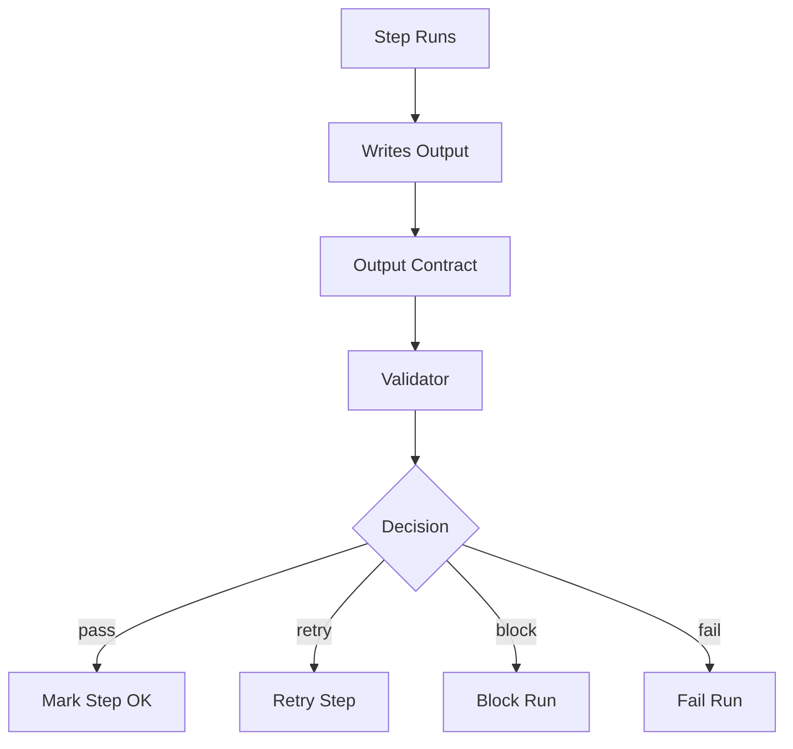

Declared outputs are the success boundary for each step. A worker can produce text, call tools, browse pages, or run commands, but the executor only marks the step successful when the expected outputs exist and pass validation.

**Validators can check:**

* file or artifact existence
* JSON/text format
* schema shape
* minimum size or item count
* semantic pass/retry/block/fail conditions
* custom validator rules
* contract freshness for cache reuse

**Design justification:**

The runtime should be able to prove a step produced the expected machine-readable result. This avoids fragile workflows where success depends on a model claiming it completed the task.

---

### 11. Cache Adoption and Resume

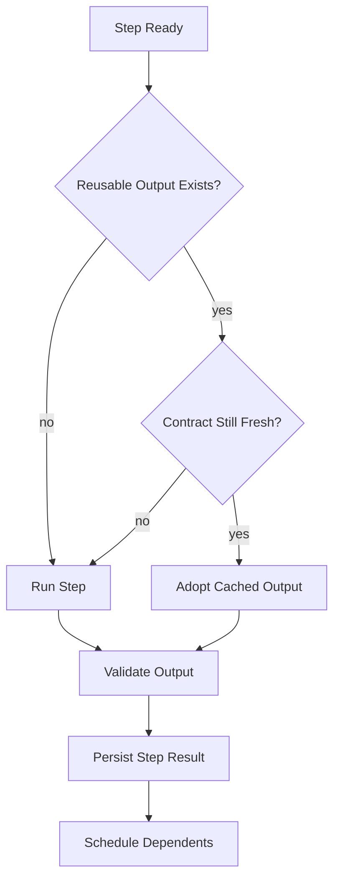

Cache adoption lets a workflow reuse previous outputs only when they still match the current contract. Resume lets interrupted workflows continue from persisted state rather than starting over.

**Cache freshness can include:**

* output contract version
* validator configuration
* selected runtime config
* input signature
* declared output paths or artifact IDs

**Design justification:**

Blind cache reuse is dangerous in agent workflows. Contract-aware reuse keeps the speed benefit of caching while preventing stale artifacts from passing through changed validation rules or changed inputs.

---

## Runtime Data Flows

### Workflow Run Flow

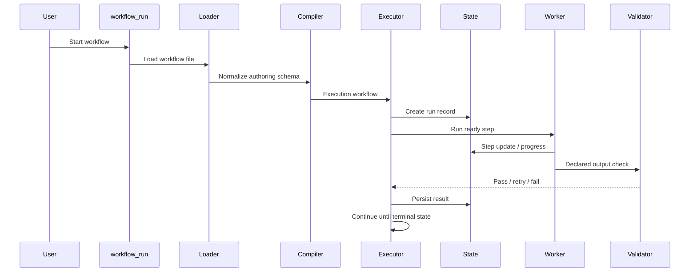

### Sealed Tool-Result Flow

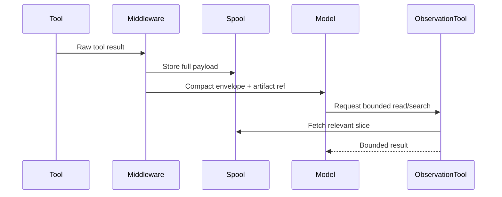

### Drain Worker Flow

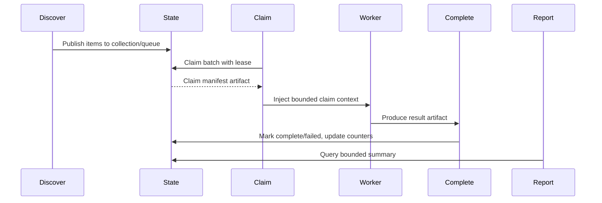

---

## Technology Stack Summary

| Layer             | Technology / Module                                                     | Purpose                                             |
| ----------------- | ----------------------------------------------------------------------- | --------------------------------------------------- |
| Runtime           | Node.js 22+                                                             | Plugin execution environment                        |
| Language          | TypeScript                                                              | Typed implementation and build output               |
| Plugin Host       | OpenClaw plugin runtime                                                 | Tool registration and agent integration             |
| Workflow Format   | YAML / JSON                                                             | Declarative workflow authoring                      |
| YAML Parser       | `js-yaml`                                                               | Load workflow definitions                           |
| Validation        | `ajv`, `@sinclair/typebox`                                              | Schema and output validation                        |
| Conditions        | `@bufbuild/cel`                                                         | Conditional validation / expression support         |
| State Backend     | Filesystem                                                              | Local run state and artifact fallback               |
| State Backend     | Redis via `ioredis`                                                     | Native Redis state, queue, counters, leases         |
| MCP Bridge        | `mcporter`                                                              | Redis access through MCP server definitions         |
| Artifact Handling | `state-artifact-stores.ts`, `sealed-spool.ts`                           | Declared outputs and sealed observations            |
| Execution         | `workflow-executor.ts`, `step-runner.ts`                                | Scheduling, retries, timeouts, dependency execution |
| Sealing           | `sealed-step-runner.ts`, `sealed-command-runner.ts`, `sealed-policy.ts` | Context firewall and artifact spooling              |

---

## Deployment and Runtime Topology

### Local Development

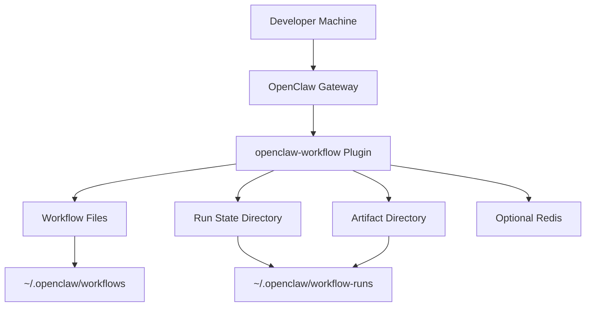

Local development can run with only the filesystem backend. This keeps the plugin easy to install, inspect, and debug. Redis can be added when testing drain workers, queue semantics, leases, counters, and Redis-backed artifact/state behavior.

### Redis-Backed Runtime

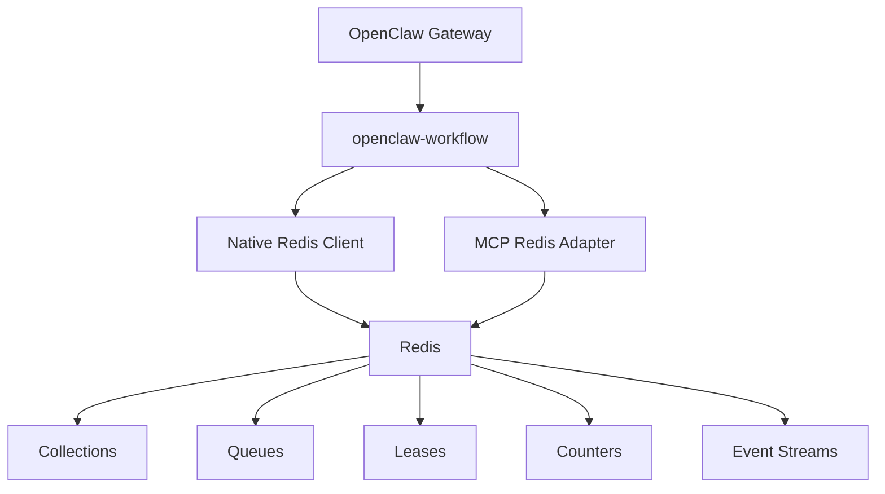

Redis-backed runtime is used when workflows need concurrent queue-backed processing, state projections, worker claims, leases, and reports.

### Filesystem Fallback

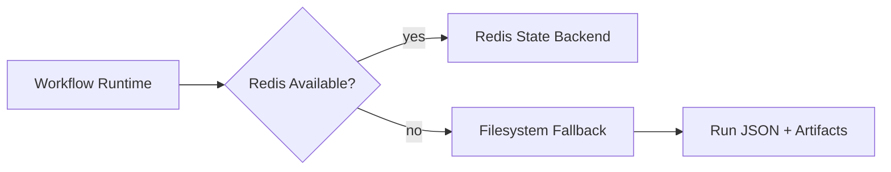

Filesystem fallback prevents the entire workflow runtime from becoming unusable when Redis is not configured or not required. Queue claims that require Redis should still fail explicitly rather than pretending filesystem mode can safely provide queue semantics.

---

## Security and Safety Architecture

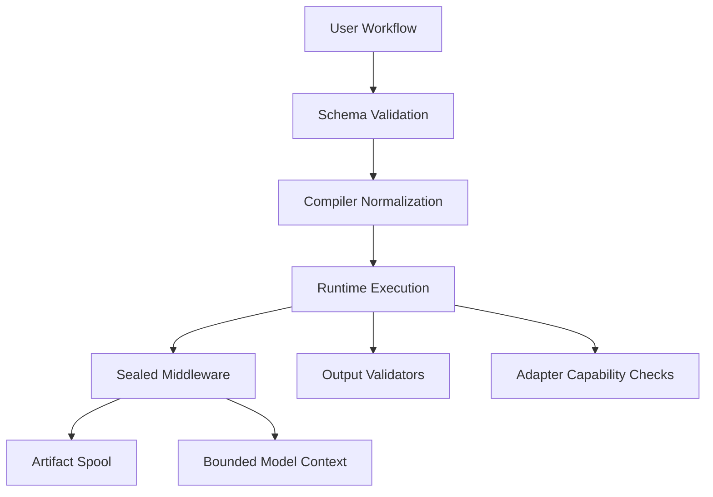

Security and safety are enforced through multiple boundaries:

| Boundary                        | Purpose                                                                               |
| ------------------------------- | ------------------------------------------------------------------------------------- |
| Authoring schema                | Reject malformed workflow definitions before runtime                                  |
| Compiler boundary               | Trust compiled in-memory output, not hand-written internal metadata                   |
| Adapter capability checks       | Fail fast when sealed runtime guarantees cannot be enforced                           |
| Sealed middleware               | Prevent raw tool results from flooding model context                                  |
| Artifact spool                  | Preserve full evidence outside context                                                |
| Output contracts                | Require machine-checkable success                                                     |
| Filesystem/Redis fallback rules | Avoid silently downgrading queue semantics                                            |
| Command runner bounds           | Keep command execution observable through stdout/stderr spooling and declared outputs |

**Design justification:**

Agent workflows are exposed to unpredictable model behavior, tool output size, browser state, and external content. The runtime should therefore prefer explicit contracts, bounded context, durable artifacts, and fail-fast capability checks over best-effort prompt conventions.

---

## Key Architectural Decisions

| Decision                                 | Why                                                    | Trade-off                                            |
| ---------------------------------------- | ------------------------------------------------------ | ---------------------------------------------------- |
| Declarative YAML/JSON workflows          | Easier to review, diff, version, and operate           | Less flexible than arbitrary orchestration code      |
| Separate authoring and execution schemas | Friendly UX with strict runtime shape                  | Compiler complexity                                  |
| Runtime-owned dependency scheduler       | Deterministic step ordering and parallelism            | More orchestration logic in plugin                   |
| Declared outputs as success condition    | Machine-checkable completion                           | Authors must define outputs clearly                  |
| Validators with pass/retry/block/fail    | Reliable recovery and gating behavior                  | Validator configuration must be maintained           |
| Sealed execution                         | Context safety and full evidence preservation          | Requires middleware capability and artifact plumbing |
| Artifact-backed observations             | Full raw data remains inspectable                      | Storage growth must be managed                       |
| Adapter abstraction                      | Survives OpenClaw API evolution                        | Multiple execution paths to test                     |
| Filesystem backend                       | Easy local development and inspection                  | Not suitable for concurrent queue semantics          |
| Redis backend                            | Queue claims, leases, counters, streams, drain workers | Additional infrastructure dependency                 |
| Filesystem fallback                      | Graceful operation for simple workflows                | Must not mask Redis-required operations              |
| Drain workers                            | Resumable, scalable batch processing                   | More state machinery than simple for_each            |
| Contract-aware cache                     | Safe reuse of prior outputs                            | Requires freshness signatures and invalidation logic |
| Auto-resume                              | Survives gateway restarts                              | Needs careful terminal-state detection               |

---

## Why This Architecture Instead of Simpler Alternatives?

### Why not just prompt one agent to do everything?

A single long-running agent session is hard to resume, hard to validate, and easy to derail with large tool outputs. This runtime decomposes work into steps with explicit dependencies and output contracts.

### Why not use shell scripts or cron chains?

Shell scripts can run commands, but they do not naturally understand agent sessions, declared outputs, retries, sealed observations, state queues, leases, or model-context safety. `openclaw-workflow` provides those as first-class runtime concepts.

### Why not make workflow authors write TypeScript graphs?

Programmatic graphs are flexible, but they make workflows harder to review and operate. YAML/JSON workflows are better when orchestration should be treated like configuration: declarative, auditable, and version-controlled.

### Why not store everything only in Redis?

Redis is useful for queue-backed state and live coordination, but filesystem artifacts are simpler for local development, inspection, and fallback. The runtime supports both so simple workflows stay lightweight while advanced drain workflows can use Redis semantics.

### Why not put raw tool results directly into model context?

Large raw outputs can exhaust context and confuse downstream reasoning. Sealed execution keeps raw evidence available without making the model carry every byte by default.

---

## Operational Concerns

### Observability

Workflow runs should expose:

* run ID
* workflow name and version
* step status
* retry attempts
* validation decisions
* declared outputs
* sealed observation refs
* state counters
* queue and lease status for drain workers

### Failure Handling

Expected failure modes include:

| Failure                   | Runtime Response                                                 |
| ------------------------- | ---------------------------------------------------------------- |
| Step timeout              | Mark attempt failed and retry if policy allows                   |
| Missing declared output   | Retry, block, or fail according to validator decision            |
| Invalid output schema     | Retry/block/fail according to validator rules                    |
| Worker crash during drain | Reclaim expired lease and retry claimed items                    |
| Redis unavailable         | Use filesystem fallback only where safe                          |
| Middleware unavailable    | Fail startup when `requireSealedToolResultMiddleware` is enabled |
| OpenClaw API mismatch     | Adapter selection fails fast or falls back where safe            |

### Scalability

The main scaling boundaries are:

* workflow-level concurrency
* step-level concurrency
* queue batch size
* lease duration
* Redis throughput
* artifact storage size
* OpenClaw session capacity
* external API/tool rate limits

### Data Retention

Artifacts and observations can grow quickly. Production use should define retention policy for:

* run state files
* declared output artifacts
* sealed raw observations
* command stdout/stderr logs
* claim manifests
* generated reports

---

## Repository Walkthrough

```text
README.md
Architecture.md
openclaw.plugin.json
package.json
examples/
scripts/
  patch-openclaw-trust-workflow-middleware.mjs
src/
  index.ts
  config.ts
  authoring-loader.ts
  authoring-compiler.ts
  authoring-types.ts
  workflow-loader.ts
  workflow-executor.ts
  workflow-state.ts
  step-runner.ts
  sealed-step-runner.ts
  sealed-command-runner.ts
  sealed-policy.ts
  sealed-spool.ts
  output-checker.ts
  output-validator.ts
  output-writer.ts
  plugin-operations.ts
  state-plugin-operations.ts
  state-artifact-stores.ts
  state-contract-projector.ts
  state-keyspace.ts
  redis-client.ts
  claim-context.ts
  return-contract.ts
  template-schema-validator.ts
  variable-substitution.ts
tests/
```

Recommended review path:


---

## Enhancement Roadmap

1. **Observability** — richer run timelines, structured event logs, and per-step metrics.
2. **Artifact retention policy** — configurable cleanup for old observations and run artifacts.
3. **Queue dashboards** — inspect pending, processing, completed, failed, and expired leased work.
4. **Validator library** — reusable built-in validators for common JSON, CSV, browser, and extraction patterns.
5. **Distributed workers** — clearer support for running drain workers across multiple OpenClaw runtimes.
6. **First-party middleware path** — remove the need for the trust patch once OpenClaw exposes stable middleware registration for external plugins.
7. **Stronger cache signatures** — improve cache invalidation based on input artifact hashes and semantic contract versions.
8. **Workflow templates** — package common patterns such as scrape → extract → classify → report.

---

## Architecture Summary

`openclaw-workflow` is built around four separations of concern:

```text
Workflow YAML = intent and contract
Executor = scheduling and lifecycle control
State backend = durable run state, queues, leases, counters
Artifact store = outputs, logs, and sealed raw observations
```

The result is a workflow runtime that can coordinate agents, commands, plugin operations, and queue-backed batch work without relying on model memory or prompt discipline. The workflow file declares what must happen; the runtime enforces how it happens safely.

